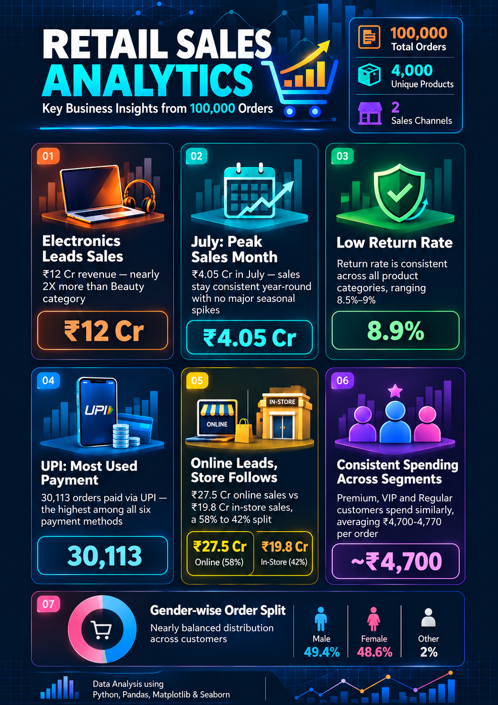

# 🛍️ Retail Sales Analysis — Python Project

Exploratory Data Analysis (EDA) of retail sales data using Python, Pandas, Matplotlib & Seaborn.

## 📊 Project Overview

This project analyzes a retail sales dataset containing **100,000 orders** to uncover business insights around sales performance, customer behavior, payment preferences, and return patterns. The analysis covers data cleaning, descriptive statistics, exploratory analysis, and visualization.

## 📁 Dataset

- **Rows:** 100,000 orders
- **Columns:** 33 (after cleaning)
- **Fields include:** Order details, Customer info, Product/Category, Sales & Profit amounts, Payment method, Region/City, Order status, Returns, Ratings

File: `retail_dataset_100000_rows.csv`

## 🛠️ Tools & Libraries Used

- **Python**
- **Pandas** — data manipulation and cleaning
- **NumPy** — numerical operations
- **Matplotlib** — data visualization
- **Seaborn** — statistical visualization
- **Jupyter Notebook** — development environment

## 🔍 Project Workflow

1. Data loading and initial exploration
2. Data cleaning (missing values, duplicates, date formatting)
3. Descriptive statistics
4. Exploratory Data Analysis (groupby, filtering, correlation)
5. Data visualization (bar chart, line chart, histogram, pie chart, heatmap, boxplot)
6. Business insights extraction

## 💡 Key Insights

1. **Electronics leads sales** — Generated ₹12 Cr in revenue, nearly 2X more than the Beauty category.
2. **July was the peak sales month** — ₹4.05 Cr in sales, though revenue stayed fairly consistent throughout the year.
3. **Low and consistent return rate** — 8.9% overall, evenly spread across all product categories.
4. **UPI is the most used payment method** — 30,113 orders, the highest among all six payment options.
5. **Online and in-store sales are balanced** — ₹27.5 Cr online (58%) vs ₹19.8 Cr in-store (42%), with similar average order values.
6. **Customer spending is consistent across segments** — Premium, VIP, and Regular customers all average ₹4,700–4,770 per order.

## 📈 Visualization

## 📂 Repository Contents

| File | Description |
|------|-------------|
| `PythonProject.ipynb` | Full Jupyter Notebook with code, analysis and visualizations |
| `retail_dataset_100000_rows.csv` | Raw dataset used for analysis |
| `Python_Project_Insights.png` | Summary infographic of key insights |

## 🚀 How to Run

1. Clone this repository
2. Install required libraries: `pip install pandas numpy matplotlib seaborn`
3. Open `PythonProject.ipynb` in Jupyter Notebook
4. Run all cells

---

*This project was built as a hands-on practice project to demonstrate data analysis and visualization skills using Python.*
